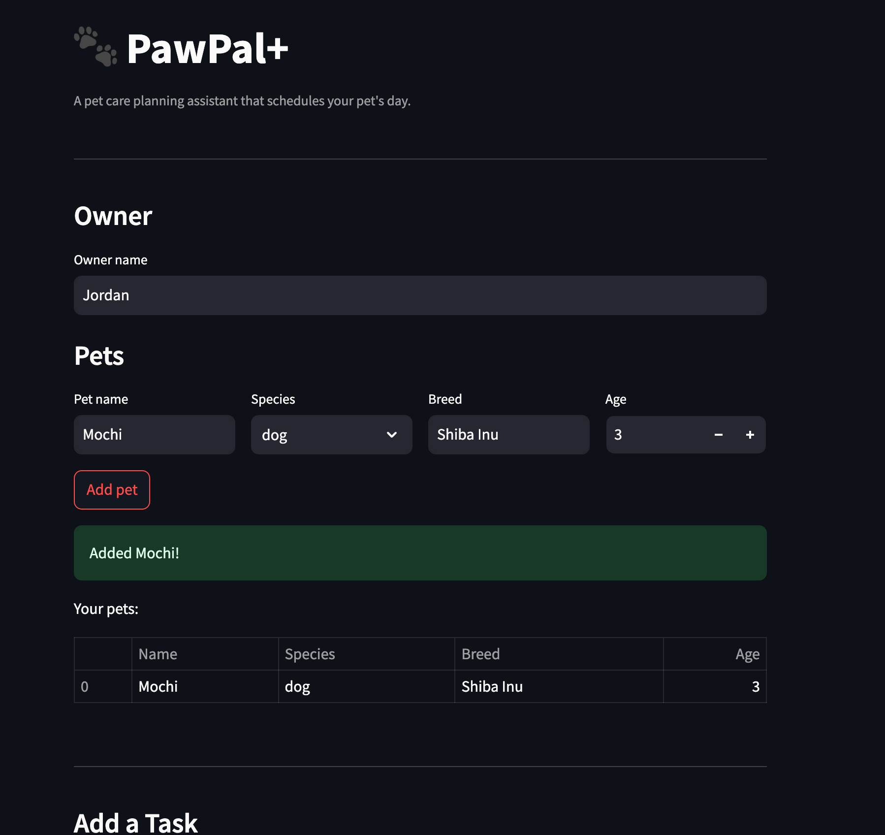

# PawPal+ User Manual


PawPal+ is a Streamlit app that helps pet owners plan and schedule daily care tasks across multiple pets. It generates a conflict-free daily schedule, flags time overlaps, and auto-schedules recurring tasks.

---

## Table of Contents

1. [Getting Started](#getting-started)
2. [Features](#features)
3. [Using the App](#using-the-app)
4. [Running Tests](#running-tests)

---

## Getting Started

### Requirements

- Python 3.10+
- Dependencies listed in `requirements.txt`

### Setup

```bash
python -m venv .venv
source .venv/bin/activate       # Windows: .venv\Scripts\activate
pip install -r requirements.txt
streamlit run app.py
```

The app opens in your browser at `http://localhost:8501`.

---

## Features

### Priority-based scheduling
Tasks are assigned time slots greedily by priority (`high → medium → low`). High-priority tasks are placed first in the day, ensuring critical care (medications, vet appointments) is never pushed out by lower-priority tasks.

### Preferred-time scheduling
A task can be given a preferred start time (e.g. "Walk at 8:00 AM"). The scheduler honors that time when the slot is free. If the slot is already taken, the task is automatically moved to the next available opening and labeled accordingly in the schedule view.

### Conflict warnings on task add
When a new task is added, the app immediately checks whether its time window overlaps any existing task on the same day. If a conflict is detected, a yellow warning banner appears with the names, times, and whether the affected tasks belong to the same pet or different pets — before the schedule is even generated.

### Conflict detection across pets
`find_conflicts()` performs a pairwise scan of all scheduled tasks and identifies both same-pet and cross-pet time overlaps. After generating a schedule, any remaining conflicts are displayed as individual warning cards showing both task names, pet names, and exact time windows.

### Daily and weekly recurrence
Tasks can be marked as `daily` or `weekly`. When a recurring task is completed, the system automatically creates the next occurrence with the correct due date and identical settings (priority, duration, preferred time), and adds it to the planner without any manual input.

### Sorted task view
The pending task list is always displayed in time order: tasks with a confirmed `scheduled_start` appear first, followed by tasks with only a `preferred_time`, followed by tasks with no time set. This gives owners a at-a-glance view of the day before generating the full schedule.

### Greedy slot-finding
`make_plan()` uses a linear scan over sorted occupied intervals to find the earliest available slot for each task. This avoids re-scanning the full task list on every conflict and keeps scheduling fast even with many tasks in a day.

### Day boundary enforcement
The planner operates within a configurable day window (default 7:00 AM – 9:00 PM). Tasks whose duration cannot fit within the remaining window are skipped rather than scheduled past the end of the day.

---

## Using the App

### 1. Set your name
Enter your name in the **Owner** field at the top.

### 2. Add pets
Fill in the pet's name, species, breed, and age, then click **Add pet**. You can add multiple pets.

### 3. Add tasks
For each task:
- Enter a title and choose which pet it is for.
- Set the duration (minutes) and priority.
- Optionally check **Set a preferred time** to pin the task to a specific time slot.
- Optionally set a **Recurrence** (`daily` or `weekly`) for tasks that repeat.
- Click **Add task**.

If the new task overlaps an existing one, a warning appears immediately with details about the conflict.

### 4. Review pending tasks
The **Pending Tasks** table shows all unscheduled tasks sorted by time. Tasks with a preferred time show it labeled `(preferred)`. Tasks with no time show `—`.

### 5. Generate the schedule
Click **Generate schedule**. The app runs `make_plan()` and displays each task as a colored block:
- **Green** (`st.success`) — task was placed at its preferred time.
- **Yellow** (`st.warning`) — task was moved to the next available slot due to a conflict.

Any remaining time overlaps are listed below the schedule as individual conflict cards.

---

## Running Tests

```bash
pytest tests/test_pawpal.py -v
```

Tests cover: task status lifecycle, recurring task spawning and field inheritance, month-boundary rollover, same-pet and cross-pet conflict detection, adjacent task boundaries, `sort_by_time` tier ordering, `make_plan` preferred-time honoring, fallback slot assignment, day-boundary overflow, and priority ordering for flexible tasks.
