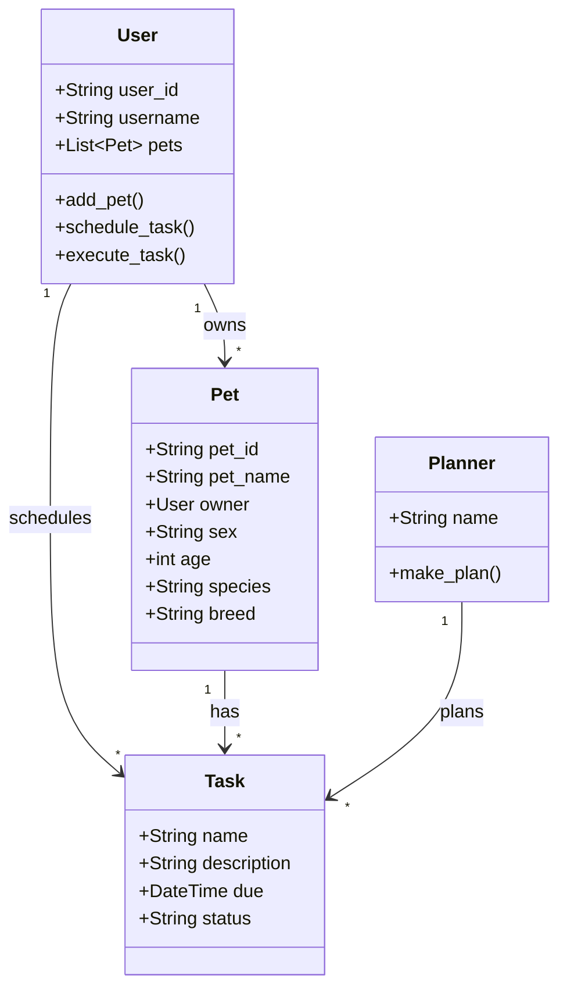

```mermaid
classDiagram
    class User {
        +String user_id
        +String username
        +List~Pet~ pets
        +add_pet()
        +schedule_task()
        +execute_task()
    }

    class Pet {
        +String pet_id
        +String pet_name
        +User owner
        +String sex
        +int age
        +String species
        +String breed
    }

    class Task {
        +String name
        +String description
        +DateTime due
        +String status
    }

    class Planner {
        +String name
        +make_plan()
    }

    User "1" --> "*" Pet : owns
    User "1" --> "*" Task : schedules
    Pet "1" --> "*" Task : has
    Planner "1" --> "*" Task : plans
```
