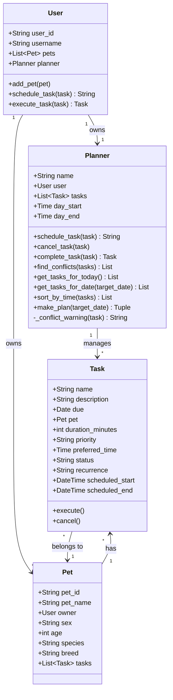

```mermaid
classDiagram
    class User {
        +String user_id
        +String username
        +List~Pet~ pets
        +Planner planner
        +add_pet(pet)
        +schedule_task(task) String
        +execute_task(task) Task
    }

    class Pet {
        +String pet_id
        +String pet_name
        +User owner
        +String sex
        +int age
        +String species
        +String breed
        +List~Task~ tasks
    }

    class Task {
        +String name
        +String description
        +Date due
        +Pet pet
        +int duration_minutes
        +String priority
        +Time preferred_time
        +String status
        +String recurrence
        +DateTime scheduled_start
        +DateTime scheduled_end
        +execute()
        +cancel()
    }

    class Planner {
        +String name
        +User user
        +List~Task~ tasks
        +Time day_start
        +Time day_end
        +schedule_task(task) String
        +cancel_task(task)
        +complete_task(task) Task
        +find_conflicts(tasks) List
        +get_tasks_for_today() List
        +get_tasks_for_date(target_date) List
        +sort_by_time(tasks) List
        +make_plan(target_date) Tuple
        -_conflict_warning(task) String
    }

    User "1" --> "1" Planner : owns
    User "1" --> "*" Pet : owns
    Pet "1" --> "*" Task : has
    Planner "1" --> "*" Task : manages
    Task "*" --> "1" Pet : belongs to
```
